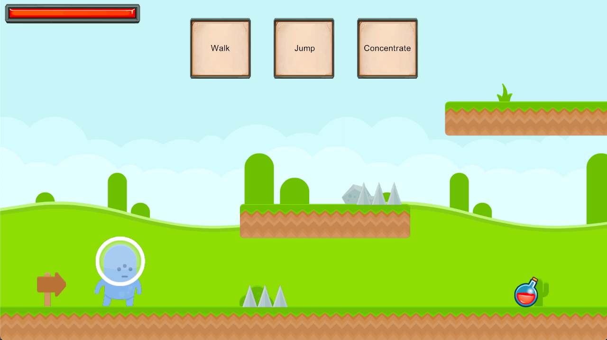

# Gosu Platformer

This is our team's entry for [Gosu Game Jam #4](https://itch.io/jam/gosu-game-jam-4).

The game is a turn-based platformer. Play actions from your deck of cards, then
see those actions play out in real time.

## Concept and Features

This game is a one-level concept with three cards to choose from. The ultimate
goal would be to have a variety of levels, cards, and enemies, with the ability
to customize your deck of cards over time.

There are other features which are partially implemented but not complete:
- Quickly restarting the level by clicking
- Hover descriptions for cards
- Graphical icons for cards

## Licenses

Software:
- First party code: GPLv3

Art:
- Environments and Characters: Creative Commons CC0 1.0 Universal (credit: www.kenney.nl)
- UI Elements and Items: Creative Commons CC-BY-3.0 (credit: www.dycha.net)
- Music: Creative Commons CC0 1.0 Universal (credit: Jordan Pool)
- Sound Effects: Zapsplat Standard License (credit: www.zapsplat.com)
